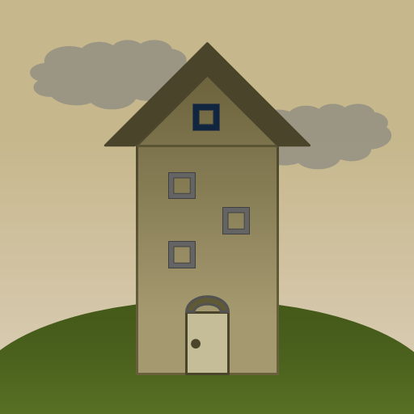

# Escape a Tower
Thanks for playing Escape a Tower!

**Did you know this game works on seriously ancient browsers?**

Don't ask me why, but I somehow managed to run Escape a Tower on browsers as far back as:

* The oldest version of Microsoft Edge (released 2015)
* The oldest version of Chrome (released 2008)
* Opera 7 (released 2003)
* The oldest version of Firefox/Firebird/Phoenix^ (released 2002)
* Netscape 6^^ (released 2000)
* Mozilla M18^^^ (released 2000)
* Internet Explorer 5.0 (released 1999), including Internet Explorer for Mac

I couldn't test the game on older versions of Safari, but it should in theory work on its oldest version (released 2003).

_^ Firebird and Phoenix were the old names of Firefox._

_^^ Netscape is a discontinued browser that prominently competed with Internet Explorer in the 90's._

_^^^ Before Firefox, the Mozilla developers worked on what was called the Mozilla Application Suite. The suite featured an experimental browser that people referred to as Mozilla._

Want to see for yourself? Download the latest version from the GitHub releases page, extract the ZIP file, and open "index.html" on the ancient browser of your choice. The normal link won't load on ancient browsers since they can't handle the latest Web security protocols (TLS 1.2+).

I highly recommend using a virtual machine to run the ancient browsers for security reasons.

## Copyright Notice
Escape a Tower is copyright (c) 2010-2020 Timothy Hsu. You may use the game layout for your personal projects, but redistributing the game text, verbatim or modified, is not permitted without the author's permission.

## Contact Info
To send feedback or bug reports about Escape a Tower, leave a comment at the following URL.

https://www.gamesbytim.com/escape-a-tower/
